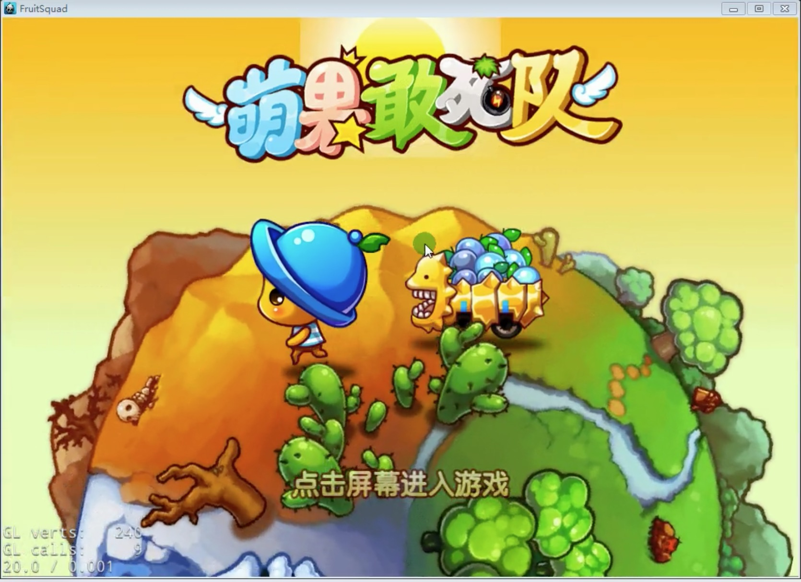
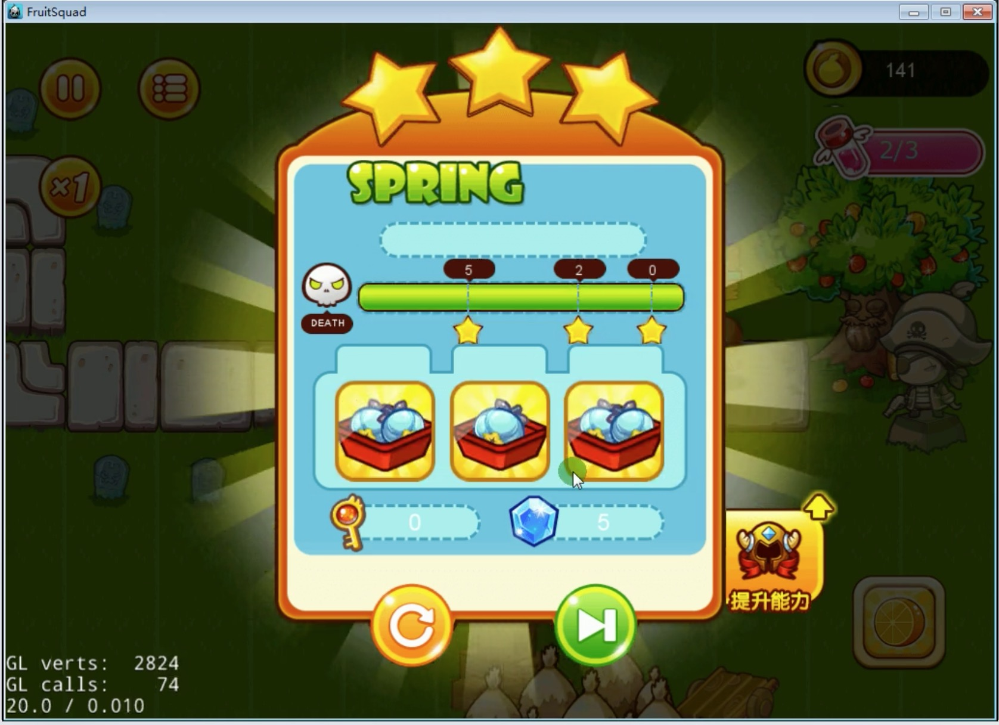

# FruitSquad
My cocos2d-x Projects

## Summary    

> 项目名称：萌果敢死队（单机版）   
> 项目介绍：一款单机的Q版逆塔防游戏！在游戏中，玩家需要操作一群萌萌的水果战士，每个战士都有自己独特的技能，你来随意搭配，冲过
昆虫和萝卜的重重阻碍，最终达到胜利的终点。   
> 游戏玩法： 
> 1、过关点将——针对关卡境况，选择敢死队英雄。防御类英雄放在队伍首位，攻击类、辅助类可以随机排序。扣血快的关卡可以采用双防御。
碰到大BOSS比较多的关卡可以选择草莓小姐。  
> 2、上帝技能——强大的敌人，需要用更强大的魔法。小怪密集的地方可以使用“炸弹”，或者冰封。大BOSS出现的时候，可以使用“残暴”。
在没有血瓶和金币的情况下，可以使用“无敌”加血扛到最后。    
> 3、满星过关——最好每一关都三星过。零星过关没有乐活果奖励，1星奖励2个乐活果。2星再奖励一个，3星共奖励5个乐活果。乐活果是团队
实力提升的唯一道具，必须尽量多的收集。     
> 4、转职升级——角色特性详解，属性数一览无余。英雄属性升级可以增加自身的血量和攻击力。一般一个队伍的英雄都达到“连长”级别，
基本上大部分关卡都能通关。       
> 5、商店系统——可以购买各种加成道具或者技能，以及角色栏位和超强角色。    
> 项目要点：Cocos2D-X引擎的使用，TiledMap地图制作和使用，TexturePackerGUI工具的使用，CocoStudio序列帧动画的使用，UI界面的制作
排布，碰撞检测，多种设计模式，Json文件的制作和读取使用，角色属性数据的设计，怪物的低级AI。  

## Screenshots

